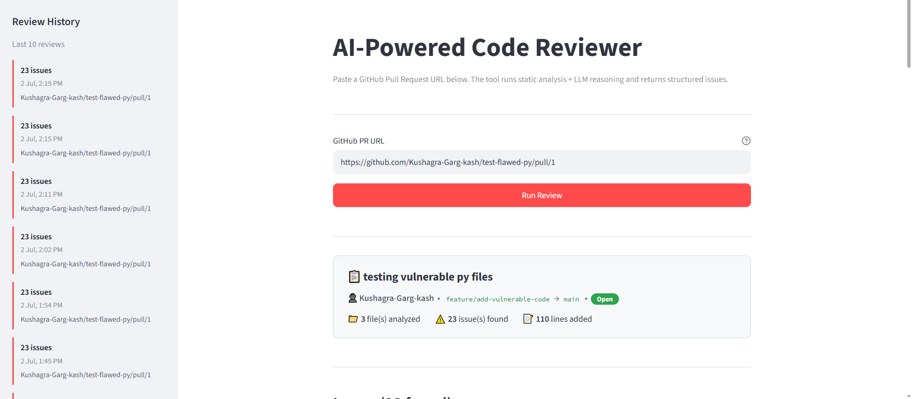
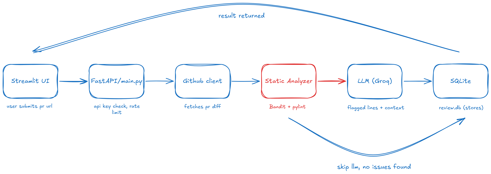

# AI-Powered Code Reviewer


A hybrid static analysis + LLM-powered code review tool for GitHub pull requests. It runs deterministic security and quality checks first, then sends only the flagged code to an LLM for plain-English explanations and fix suggestions — keeping reviews fast, cheap, and consistent.

---

## Demo

🎥 **Demo video:** [Watch on Loom](https://www.loom.com/share/982833489f4b48e59c28304c63f81f9a)


_Streamlit UI showing a completed review, grouped by severity._

---

## Architecture



The system follows a 5-layer pipeline:

1. **GitHub Integration Layer** — fetches PR diffs via the GitHub REST API, extracts only changed Python files.
2. **Static Analysis Layer** — runs **Bandit** (security) and **Pylint** (code quality) on changed lines, normalizes both outputs into a single issue format.
3. **LLM Reasoning Layer** — sends only flagged lines (with surrounding context) to **Groq** (`openai/gpt-oss-20b`) for structured explanations and fix suggestions. If static analysis finds nothing, the LLM is never called — zero cost, zero latency.
4. **API + Storage Layer** — FastAPI exposes the REST endpoints; SQLite stores review history; API key auth and per-IP rate limiting (slowapi) protect the service.
5. **Presentation Layer** — a Streamlit frontend renders results color-coded by severity, with a markdown export for pasting into PR comments.

---

## Key Features

- **Hybrid pipeline** — static analysis first, LLM only on flagged code (~60–70% reduction in token usage vs. sending full files)
- **Diff-aware processing** — analyzes only changed lines, not entire files
- **Structured JSON output** — LLM responses validated against a Pydantic schema
- **Token chunking** — large PRs are split into ~100-line chunks and merged
- **Auth + rate limiting** — `X-API-Key` header required, 10 requests/min per IP
- **Review history** — past reviews stored and browsable via SQLite

---

## Tech Stack

| Component | Tool | Why |
|---|---|---|
| Language | Python 3.11 | Fast path to working AI integration |
| Web Framework | FastAPI | Async, auto-docs, native Pydantic validation |
| LLM Provider | Groq (`openai/gpt-oss-20b`) | Fast inference, OpenAI-compatible API, low cost |
| Security Linter | Bandit | Industry-standard Python security linter |
| Code Linter | Pylint | Configurable, JSON-output quality analysis |
| Database | SQLite | Zero-config, sufficient at this scale |
| Frontend | Streamlit | Fast UI without frontend JS |
| Rate Limiting / Auth | slowapi + custom API key dependency | Per-IP throttling, simple key-based access control |
| Testing | pytest | 21 tests across client, analyzer, and LLM modules |
| CI | GitHub Actions | Automated test run on every push |

> **Note:** the original project blueprint referenced OpenAI GPT-4o. The implementation uses **Groq** (`openai/gpt-oss-20b`) instead, for cost and latency reasons — see [Known Limitations](#known-limitations).

---

## Project Structure

```
ai-code-reviewer/
├── main.py                  # FastAPI app entry point
├── requirements.txt
├── Dockerfile
├── .env.example
├── .gitignore
├── pytest.ini
├── app/
│   ├── __init__.py
│   ├── github_client.py     # GitHub REST API calls, PR diff fetching
│   ├── static_analyzer.py   # Runs Bandit + Pylint, normalizes results
│   ├── llm_client.py        # Groq API calls, prompt construction, chunking
│   ├── report_generator.py  # JSON results → markdown report
│   ├── database.py          # SQLite setup, review history
│   ├── reviews.db           # SQLite database file (gitignored)
│   ├── models.py            # Pydantic request/response schemas
│   ├── auth.py               # API key validation
│   └── rate_limiter.py      # slowapi configuration
├── frontend/
│   └── streamlit_app.py     # Streamlit UI
├── tests/
│   ├── conftest.py
│   ├── test_github_client.py
│   ├── test_static_analyzer.py
│   └── test_llm_client.py
└── .github/workflows/ci.yml
```

---

## Setup & Installation

### Prerequisites
- Python 3.11+
- A GitHub personal access token
- A Groq API key

### Local setup

```bash
git clone https://github.com/Kushagra-Garg-kash/ai-code-reviewer.git
cd ai-code-reviewer

python -m venv venv
source venv/bin/activate      # Windows: venv\Scripts\activate

pip install -r requirements.txt

cp .env.example .env          # then fill in the values below
```

**.env**
```
GROQ_API_KEY=your_groq_key
GITHUB_TOKEN=your_github_pat
APP_API_KEY=your_chosen_api_key
```

**Run the backend**
```bash
uvicorn main:app --reload
```

**Run the frontend** (separate terminal)
```bash
streamlit run frontend/streamlit_app.py
```

### Docker _(coming in Week 4)_
```bash
docker build -t ai-code-reviewer .
docker run -p 8000:8000 --env-file .env ai-code-reviewer
```

---

## API Usage

**POST** `/review`

Headers:
```
X-API-Key: your_chosen_api_key
Content-Type: application/json
```

Body:
```json
{
  "pr_url": "https://github.com/owner/repo/pull/123"
}
```

Response:
```json
{
  "issues": [
    {
      "line": 42,
      "severity": "critical",
      "issue_title": "Hardcoded Secret",
      "explanation": "...",
      "fix_suggestion": "..."
    }
  ],
  "model_used": "openai/gpt-oss-20b"
}
```

---

## Testing

```bash
pytest
```

21 tests currently cover diff parsing, static analysis output normalization, and LLM client behavior (mocked, no API cost).

---

## Known Limitations

- **Pagination cap:** `fetch_pr_files()` currently fetches only the first 30 changed files per PR (GitHub API pagination not yet implemented) — fix planned.
- **LLM suggestions are advisory**, not guaranteed correct — labeled as such in output, and human review is still expected.
- **Response time:** the `/review` endpoint runs the pipeline sequentially (~10s typical) — an async job queue (Celery/Redis) is a planned improvement rather than a current bottleneck fix.

---

## Future Improvements

- Async job queue (Celery + Redis) for horizontal scaling
- JavaScript/TypeScript support via ESLint
- Feedback loop (thumbs up/down) on LLM suggestions
- GitHub App with OAuth instead of personal access token

---

## License

MIT
